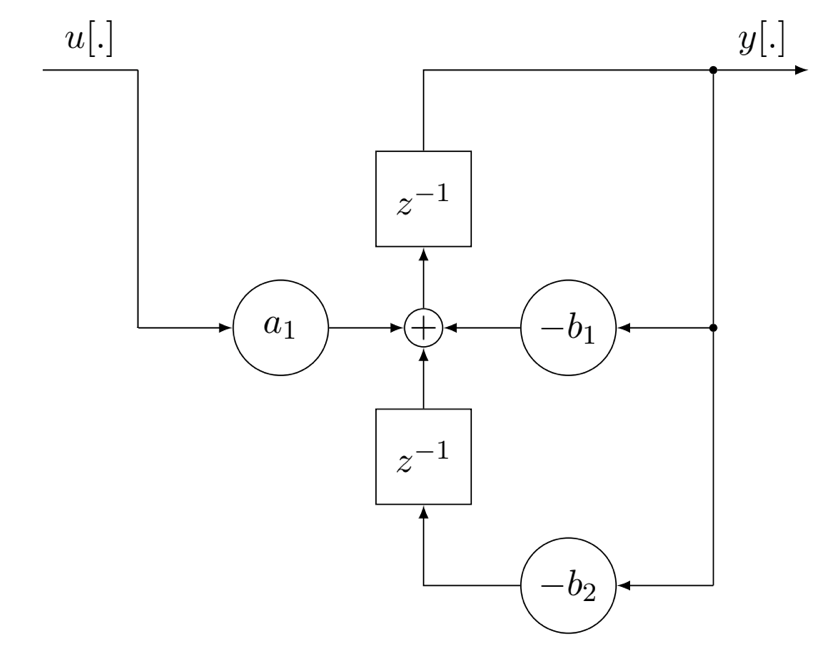
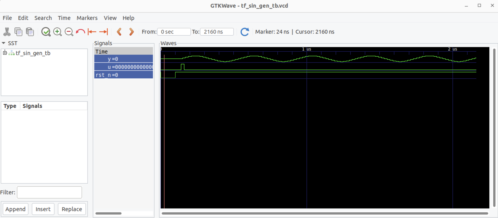

# Verilog implementation for non-synthesizable sine wave generator inspired by Goertzel algorithm

## Design description

The design implements LTI system with impulse response f[k] for k>=0:
```math
f[k] = sin(Ωk)
```
The transfer function of the system:  


```math
F(z) = {sin(Ω)z \over z^2 - 2zcos(Ω)+1}
```
and 
```math
ROC(f) = \{z ∈ C : |z| > |p| = 1\}
```
Implementation in the observable canonical form (a0 = 0, a1 = sin(Ω), a2 = 0, b1 = −2 cos(Ω), b2 = 1):




## Steps to simulate design and plot waveforms

1. Install Icarus verilog: `sudo apt install iverilog`
2. Install gtkwave: `sudo apt install gtkwave`
3. Run `make` 

## Simulation results

